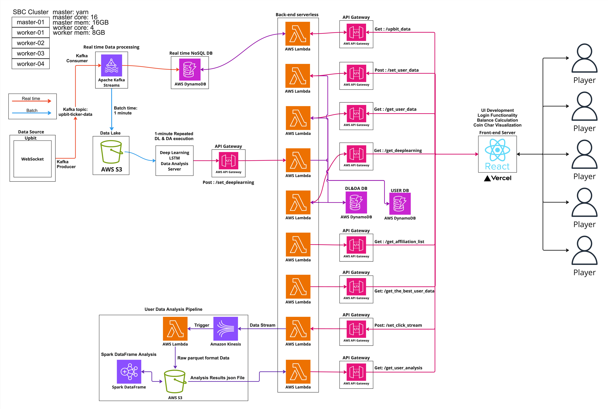

# 🏆 Coin Prediction King - Backend

**Coin Prediction King** is a real-time cryptocurrency prediction game where players can select coins and compete based on market performance. This repository contains the backend infrastructure that powers the game.

## 📌 Project Overview

The backend architecture is designed for real-time data processing, user interactions, and deep learning analysis. The system integrates **Kafka, AWS Lambda, DynamoDB, S3, and Spark** for efficient data handling.

## 🛠️ Tech Stack

- **Data Collection & Processing**
  - Upbit WebSocket API
  - Apache Kafka (Producer & Consumer)
  - AWS DynamoDB
  - AWS S3 (Data Lake)
  
- **Backend Services**
  - AWS Lambda (Serverless execution)
  - AWS API Gateway (API Management)
  
- **Deep Learning & Analytics**
  - LSTM-based Prediction Model
  - Amazon Kinesis for User Data Stream
  - Spark DataFrame Analysis

- **Frontend & Deployment**
  - React.js
  - Vercel (Frontend Hosting)

---

## 📊 System Architecture

---

## 🔥 API Endpoints

### 📌 Real-Time Crypto Data

| Method | URL | Request | Response |
|--------|-----|---------|----------|
| **GET** | `/upbit_data` | - | `[{"trade_price": 82635000.0, "code": "KRW-BTC", "change": "RISE", ...}]` |

### 📌 User Data Management

| Method | URL | Request | Response |
|--------|-----|---------|----------|
| **POST** | `/set_user_data` | `{ "student_id": "20201515", "name": "홍길동", "department": "컴퓨터공학과", "nickname": "코인마스터", ... }` | `{ "message": "Data saved successfully" }` |
| **GET** | `/get_user_data` | - | `{ "message": "유저 데이터 가져옴", "data": [...] }` |
| **GET** | `/get_the_best_user_data` | - | `{ "message": "1등 유저 데이터 가져옴", "data": { "nickname": "찬영", "balance": 4771917000, ... } }` |
| **GET** | `/get_department_list` | - | `{ "message": "학과 리스트 가져옴", "departments": ["컴퓨터공학과", "정보보호학과", ...] }` |

### 📌 Deep Learning & Analytics

| Method | URL | Request | Response |
|--------|-----|---------|----------|
| **POST** | `/set_deeplearning` | `[ { "code": "KRW-BTC", "fastest_growth": true, ... }, ... ]` | `{ "message": "Deep learning results saved successfully" }` |
| **GET** | `/get_deeplearning` | - | `[ { "code": "KRW-BTC", "fastest_growth": true, ... }, ... ]` |

### 📌 Clickstream Data

| Method | URL | Request | Response |
|--------|-----|---------|----------|
| **POST** | `/set_click_stream` | `{ "user_name": "CryptoWarrior", "selected_coins": ["BTC", "ETH", "SOL"], ... }` | `{ "message": "Clickstream data saved successfully" }` |

---
